# OpenKIS - Entity-Relationship Diagram

This document describes the database schema of OpenKIS (Opensource Karst Information System).

## ER Diagram (Mermaid)

```mermaid
erDiagram
    %% ==========================================
    %% MAIN ENTITIES - NATURAL CAVES
    %% ==========================================

    ctl_caves {
        int id PK
        string code UK "Cadastre number"
        string name "Cave name"
        string synonyms "Other names"
        string caveslinks FK "Linked caves"
        string firstreference "First surveyor"
        string country
        string regione "Region"
        string provincia "Province"
        string comune "Municipality"
        string localita "Locality"
        string areas FK "Karst area"
        string geologicalformation FK
        string coordinates_type FK
        float latitude
        float longitude
        string lenght_total "Total length (m)"
        string depth_total "Total depth (m)"
        string hydrology
        string meteorology
        text description
        image photo1
        string status "draft|verify|validated|rejected"
        string groupview FK "View permissions"
        string groupinsert FK "Edit permissions"
        datetime recordinsert
        datetime recordupdate
        string username
    }

    ctl_surveys {
        int id PK
        string codecave FK "Cave code"
        string name "Survey name"
        image photo1
        file file "Source file"
        file filekml
        file filelox
        file filepdf
        datetime date
        string author
        text makers "Surveyors"
        string license FK
        text description
        string groupview FK
    }

    ctl_photos {
        int id PK
        string codecave FK
        string name
        image photo
        datetime date
        string author
        string license FK
        text description
    }

    ctl_attachments {
        int id PK
        string codecave FK
        string name
        file file
        text description
    }

    ctl_faunacave {
        int id PK
        string name FK "Scientific species name"
        string codecave FK "Natural cave"
        string codeartificial FK "Artificial cavity"
        string ammount "Specimen count"
        text description
        image photo1
        datetime date
        string caver "Surveyed by"
    }

    ctl_caves_versions {
        int id PK
        string codecave FK
        text data "Historical version"
    }

    ctl_caves_rules {
        int id PK
        string codecave FK
        string rules "Permission rules"
    }

    %% ==========================================
    %% MAIN ENTITIES - ARTIFICIAL CAVITIES
    %% ==========================================

    ctl_artificials {
        int id PK
        string code UK
        string name
        string synonyms
        string caveslinks FK "Linked cavities"
        string firstreference
        string regione "Region"
        string provincia "Province"
        string comune "Municipality"
        string localita "Locality"
        string address
        string year "Construction year"
        string epoch "Historical epoch"
        string typology FK "Typology"
        string category FK "Category"
        string geologicalformation FK
        string coordinates_type FK
        float latitude
        float longitude
        string lenght_total
        string depth_total
        text description
        image photo1
        string groupview FK
        string groupinsert FK
    }

    ctl_surveys_artificials {
        int id PK
        string codeartificial FK
        string name
        image photo1
        file filekml
        datetime date
        string author
        string license FK
    }

    ctl_photos_artificials {
        int id PK
        string codeartificial FK
        string name
        image photo
        string license FK
    }

    ctl_attachments_artificials {
        int id PK
        string codeartificial FK
        string name
        file file
    }

    ctl_artificials_versions {
        int id PK
        string codeartificial FK
        text data
    }

    %% ==========================================
    %% KARST SPRINGS
    %% ==========================================

    ctl_springs {
        int id PK
        string code
        string codecave FK "Linked cave"
        string name
        string regione "Region"
        string provincia "Province"
        string comune "Municipality"
        string areas FK
        string coordinates_type FK
        float latitude
        float longitude
        string flow_max "Maximum flow"
        string flow_min "Minimum flow"
        string flow_average "Average flow"
        string use "free|captured"
        string utilization "drinking|agricoltural|industrial"
        text description
        image photo1
    }

    %% ==========================================
    %% GLACIAL CAVITIES
    %% ==========================================

    ctl_glacial {
        int id PK
        string code UK
        string name
        string glaciers FK "Glacier"
        string regione "Region"
        string provincia "Province"
        string comune "Municipality"
        string coordinates_type FK
        float latitude
        float longitude
        string lenght_total
        string depth_total
        string typology "moulin|contact cavity"
        text description
        string license FK
        image photo1
    }

    ctl_glaciers {
        int id PK
        string code UK
        string name
        string regione "Region"
        text description
    }

    ctl_surveys_glacial {
        int id PK
        string codeglacial FK
        string name
        image photo1
        file filekml
        datetime date
        string author
        string license FK
    }

    %% ==========================================
    %% CAVE SYSTEMS
    %% ==========================================

    ctl_cavesystems {
        int id PK
        string code UK
        string name
        string areas FK
        string caves FK "Linked caves (multicave)"
        string lenght_total
        string depth_total
        text description
        image photo1
    }

    %% ==========================================
    %% KARST AREAS
    %% ==========================================

    ctl_areas {
        int id PK
        string code UK
        string name
        string regione "Region"
        string provincia "Province"
        string comune "Municipality"
        text description
        string surface "Surface area (ha)"
        text lithological
        text geomorphology
        text hydrogeological
        text caving
        file filekml
        image photo1
    }

    %% ==========================================
    %% FAUNA
    %% ==========================================

    ctl_fauna {
        int id PK
        string scientific_name UK
        string name "Common name"
        string sinon "Synonyms"
        string phylum
        string class
        string order
        string family
        string genus
        string type "TROGLOXENE|TROGLOPHILE|TROGLOBITE|etc"
        text description
        image photo1
    }

    %% ==========================================
    %% BIBLIOGRAPHY
    %% ==========================================

    ctl_bibliography {
        int id PK
        string title
        string magazine
        string authors
        string editor
        string country
        string city
        string year
        string pages
        text abstract
        string codecaves FK "Cited caves (multicave)"
        string codeartificials "Cited artificials"
        string fauna FK "Covered fauna"
        file file1 "Article extract"
        string license FK
        image photo1
    }

    %% ==========================================
    %% LOOKUP TABLES
    %% ==========================================

    ctl_coordinatestypes {
        string coordinates_type PK
        text description
        string proj4 "Proj4 definition"
    }

    ctl_geologicalformations {
        int id PK
        string code UK
        string name
        text description
    }

    ctl_licenses {
        int id PK
        string name UK
        text description
        text license "License text"
    }

    ctl_art_categories {
        int id PK
        string code UK
        string name
    }

    ctl_art_types {
        int id PK
        string code UK
        string name
    }

    %% ==========================================
    %% SYSTEM (Finis Framework)
    %% ==========================================

    fn_users {
        int id PK
        string username UK
        string email
        string password
        string groups "User groups"
    }

    fn_groups {
        int id PK
        string groupname UK
        text description
    }

    %% ==========================================
    %% RELATIONSHIPS - NATURAL CAVES
    %% ==========================================

    ctl_caves ||--o{ ctl_surveys : "codecave"
    ctl_caves ||--o{ ctl_photos : "codecave"
    ctl_caves ||--o{ ctl_attachments : "codecave"
    ctl_caves ||--o{ ctl_faunacave : "codecave"
    ctl_caves ||--o{ ctl_caves_versions : "codecave"
    ctl_caves ||--o{ ctl_caves_rules : "codecave"
    ctl_caves }o--o{ ctl_caves : "caveslinks (self-ref)"
    ctl_caves }o--|| ctl_areas : "areas"
    ctl_caves }o--|| ctl_coordinatestypes : "coordinates_type"
    ctl_caves }o--|| ctl_geologicalformations : "geologicalformation"

    %% ==========================================
    %% RELATIONSHIPS - ARTIFICIAL CAVITIES
    %% ==========================================

    ctl_artificials ||--o{ ctl_surveys_artificials : "codeartificial"
    ctl_artificials ||--o{ ctl_photos_artificials : "codeartificial"
    ctl_artificials ||--o{ ctl_attachments_artificials : "codeartificial"
    ctl_artificials ||--o{ ctl_faunacave : "codeartificial"
    ctl_artificials ||--o{ ctl_artificials_versions : "codeartificial"
    ctl_artificials }o--o{ ctl_artificials : "caveslinks (self-ref)"
    ctl_artificials }o--|| ctl_coordinatestypes : "coordinates_type"
    ctl_artificials }o--|| ctl_geologicalformations : "geologicalformation"
    ctl_artificials }o--|| ctl_art_categories : "category"
    ctl_artificials }o--|| ctl_art_types : "typology"

    %% ==========================================
    %% RELATIONSHIPS - SPRINGS
    %% ==========================================

    ctl_springs }o--|| ctl_caves : "codecave"
    ctl_springs }o--|| ctl_areas : "areas"
    ctl_springs }o--|| ctl_coordinatestypes : "coordinates_type"

    %% ==========================================
    %% RELATIONSHIPS - GLACIAL
    %% ==========================================

    ctl_glacial ||--o{ ctl_surveys_glacial : "codeglacial"
    ctl_glacial }o--|| ctl_glaciers : "glaciers"
    ctl_glacial }o--|| ctl_coordinatestypes : "coordinates_type"
    ctl_glacial }o--|| ctl_licenses : "license"

    %% ==========================================
    %% RELATIONSHIPS - SYSTEMS
    %% ==========================================

    ctl_cavesystems }o--o{ ctl_caves : "caves (multicave)"
    ctl_cavesystems }o--|| ctl_areas : "areas"

    %% ==========================================
    %% RELATIONSHIPS - FAUNA
    %% ==========================================

    ctl_fauna ||--o{ ctl_faunacave : "scientific_name"

    %% ==========================================
    %% RELATIONSHIPS - BIBLIOGRAPHY
    %% ==========================================

    ctl_bibliography }o--o{ ctl_caves : "codecaves (multicave)"
    ctl_bibliography }o--o{ ctl_fauna : "fauna (multicave)"
    ctl_bibliography }o--|| ctl_licenses : "license"

    %% ==========================================
    %% RELATIONSHIPS - LICENSES
    %% ==========================================

    ctl_licenses ||--o{ ctl_surveys : "license"
    ctl_licenses ||--o{ ctl_photos : "license"
    ctl_licenses ||--o{ ctl_surveys_artificials : "license"
    ctl_licenses ||--o{ ctl_surveys_glacial : "license"

    %% ==========================================
    %% RELATIONSHIPS - PERMISSIONS
    %% ==========================================

    fn_groups ||--o{ ctl_caves : "groupview/groupinsert"
    fn_groups ||--o{ ctl_artificials : "groupview/groupinsert"
```

## Main Entities Description

### Speleological Domain

| Table | Description |
|-------|-------------|
| `ctl_caves` | Natural caves - main cadastre entity |
| `ctl_artificials` | Artificial cavities (mines, bunkers, aqueducts, etc.) |
| `ctl_springs` | Karst springs |
| `ctl_glacial` | Glacial cavities (glacier mills, contact caves) |
| `ctl_cavesystems` | Connected cave systems |
| `ctl_areas` | Geographical karst areas |

### Associated Data

| Table | Description |
|-------|-------------|
| `ctl_surveys` | Topographic surveys of natural caves |
| `ctl_photos` | Photos of natural caves |
| `ctl_attachments` | Attachments (documents, files) for caves |
| `ctl_faunacave` | Fauna surveys (linked to caves or artificials) |
| `ctl_bibliography` | Speleological bibliography |

### Fauna Catalogs

| Table | Description |
|-------|-------------|
| `ctl_fauna` | Fauna species catalog (complete taxonomy) |

### Lookup Tables

| Table | Description |
|-------|-------------|
| `ctl_coordinatestypes` | Coordinate types (WGS84, UTM, etc.) with Proj4 definition |
| `ctl_geologicalformations` | Geological formations |
| `ctl_licenses` | Content licenses (CC-BY, etc.) |
| `ctl_art_categories` | Artificial cavity categories |
| `ctl_art_types` | Artificial cavity typologies |

## Key Relationships

### 1:N Relationships (One-to-Many)

- **Cave -> Surveys**: A cave can have many topographic surveys
- **Cave -> Photos**: A cave can have many photos
- **Cave -> Attachments**: A cave can have many attachments
- **Cave -> Fauna surveys**: A cave can have many fauna surveys
- **Fauna species -> Surveys**: A species can be surveyed in many caves

### N:M Relationships (Many-to-Many) via multicave fields

- **Caves <-> Caves**: Caves linked to each other (multiple entrances, junctions)
- **Systems <-> Caves**: A system groups multiple caves
- **Bibliography <-> Caves**: A publication can cite multiple caves
- **Bibliography <-> Fauna**: A publication can cover multiple species

### Relationships with Lookup Tables

- All geographic entities -> `ctl_coordinatestypes` (coordinate type)
- Caves/Artificials -> `ctl_geologicalformations` (geological formation)
- Caves/Artificials -> `ctl_areas` (karst area)
- Multimedia content -> `ctl_licenses` (usage license)

## Technical Notes

1. **Primary Keys**: All tables use auto-increment `id` as PK
2. **Business Keys**: The `code` field is used as logical identifier (e.g., "LI928" for Ligurian cave n.928)
3. **Relationships**: Implemented via string fields (not SQL FK) for flexibility
4. **Multicave**: Fields containing comma-separated lists (e.g., "LI1,LI2,LI3")
5. **Soft Delete**: `recorddeleted` field for logical deletion
6. **Versioning**: `*_versions` tables for modification history
7. **Permissions**: `groupview`/`groupinsert` fields for granular access control
