# OpenKIS - Diagramma Entità-Relazione

Questo documento descrive lo schema del database di OpenKIS (Opensource Karst Information System).

## Diagramma ER (Mermaid)

```mermaid
erDiagram
    %% ==========================================
    %% ENTITA' PRINCIPALI - CAVITA' NATURALI
    %% ==========================================

    ctl_caves {
        int id PK
        string code UK "Numero catasto"
        string name "Nome grotta"
        string synonyms "Altre denominazioni"
        string caveslinks FK "Grotte collegate"
        string firstreference "Primo censitore"
        string country
        string regione
        string provincia
        string comune
        string localita
        string areas FK "Area carsica"
        string geologicalformation FK
        string coordinates_type FK
        float latitude
        float longitude
        string lenght_total "Sviluppo reale (m)"
        string depth_total "Dislivello totale (m)"
        string hydrology
        string meteorology
        text description
        image photo1
        string status "draft|verify|validated|rejected"
        string groupview FK "Permessi visualizzazione"
        string groupinsert FK "Permessi modifica"
        datetime recordinsert
        datetime recordupdate
        string username
    }

    ctl_surveys {
        int id PK
        string codecave FK "Codice grotta"
        string name "Nome rilievo"
        image photo1
        file file "File sorgente"
        file filekml
        file filelox
        file filepdf
        datetime date
        string author
        text makers "Rilevatori"
        string license FK
        text description
        string groupview FK
    }

    ctl_photos {
        int id PK
        string codecave FK
        string name
        image photo
        datetime date
        string author
        string license FK
        text description
    }

    ctl_attachments {
        int id PK
        string codecave FK
        string name
        file file
        text description
    }

    ctl_faunacave {
        int id PK
        string name FK "Nome scientifico specie"
        string codecave FK "Grotta naturale"
        string codeartificial FK "Cavita artificiale"
        string ammount "Numero esemplari"
        text description
        image photo1
        datetime date
        string caver "Rilevato da"
    }

    ctl_caves_versions {
        int id PK
        string codecave FK
        text data "Versione storica"
    }

    ctl_caves_rules {
        int id PK
        string codecave FK
        string rules "Regole permessi"
    }

    %% ==========================================
    %% ENTITA' PRINCIPALI - CAVITA' ARTIFICIALI
    %% ==========================================

    ctl_artificials {
        int id PK
        string code UK
        string name
        string synonyms
        string caveslinks FK "Cavita collegate"
        string firstreference
        string regione
        string provincia
        string comune
        string localita
        string address
        string year "Anno costruzione"
        string epoch "Epoca storica"
        string typology FK "Tipologia"
        string category FK "Categoria"
        string geologicalformation FK
        string coordinates_type FK
        float latitude
        float longitude
        string lenght_total
        string depth_total
        text description
        image photo1
        string groupview FK
        string groupinsert FK
    }

    ctl_surveys_artificials {
        int id PK
        string codeartificial FK
        string name
        image photo1
        file filekml
        datetime date
        string author
        string license FK
    }

    ctl_photos_artificials {
        int id PK
        string codeartificial FK
        string name
        image photo
        string license FK
    }

    ctl_attachments_artificials {
        int id PK
        string codeartificial FK
        string name
        file file
    }

    ctl_artificials_versions {
        int id PK
        string codeartificial FK
        text data
    }

    %% ==========================================
    %% SORGENTI CARSICHE
    %% ==========================================

    ctl_springs {
        int id PK
        string code
        string codecave FK "Grotta collegata"
        string name
        string regione
        string provincia
        string comune
        string areas FK
        string coordinates_type FK
        float latitude
        float longitude
        string flow_max "Portata massima"
        string flow_min "Portata minima"
        string flow_average "Portata media"
        string use "free|captured"
        string utilization "drinking|agricoltural|industrial"
        text description
        image photo1
    }

    %% ==========================================
    %% CAVITA' GLACIALI
    %% ==========================================

    ctl_glacial {
        int id PK
        string code UK
        string name
        string glaciers FK "Ghiacciaio"
        string regione
        string provincia
        string comune
        string coordinates_type FK
        float latitude
        float longitude
        string lenght_total
        string depth_total
        string typology "moulin|contact cavity"
        text description
        string license FK
        image photo1
    }

    ctl_glaciers {
        int id PK
        string code UK
        string name
        string regione
        text description
    }

    ctl_surveys_glacial {
        int id PK
        string codeglacial FK
        string name
        image photo1
        file filekml
        datetime date
        string author
        string license FK
    }

    %% ==========================================
    %% SISTEMI DI GROTTE
    %% ==========================================

    ctl_cavesystems {
        int id PK
        string code UK
        string name
        string areas FK
        string caves FK "Grotte collegate (multicave)"
        string lenght_total
        string depth_total
        text description
        image photo1
    }

    %% ==========================================
    %% AREE CARSICHE
    %% ==========================================

    ctl_areas {
        int id PK
        string code UK
        string name
        string regione
        string provincia
        string comune
        text description
        string surface "Superficie (ha)"
        text lithological
        text geomorphology
        text hydrogeological
        text caving
        file filekml
        image photo1
    }

    %% ==========================================
    %% FAUNA
    %% ==========================================

    ctl_fauna {
        int id PK
        string scientific_name UK
        string name "Nome comune"
        string sinon "Sinonimi"
        string phylum
        string class
        string order
        string family
        string genus
        string type "TROGLOSSENO|TROGLOFILO|TROGLOBIO|etc"
        text description
        image photo1
    }

    %% ==========================================
    %% BIBLIOGRAFIA
    %% ==========================================

    ctl_bibliography {
        int id PK
        string title
        string magazine
        string authors
        string editor
        string country
        string city
        string year
        string pages
        text abstract
        string codecaves FK "Grotte citate (multicave)"
        string codeartificials "Artificiali citate"
        string fauna FK "Fauna trattata"
        file file1 "Estratto articolo"
        string license FK
        image photo1
    }

    %% ==========================================
    %% TABELLE DI LOOKUP
    %% ==========================================

    ctl_coordinatestypes {
        string coordinates_type PK
        text description
        string proj4 "Definizione Proj4"
    }

    ctl_geologicalformations {
        int id PK
        string code UK
        string name
        text description
    }

    ctl_licenses {
        int id PK
        string name UK
        text description
        text license "Testo licenza"
    }

    ctl_art_categories {
        int id PK
        string code UK
        string name
    }

    ctl_art_types {
        int id PK
        string code UK
        string name
    }

    %% ==========================================
    %% SISTEMA (Framework Finis)
    %% ==========================================

    fn_users {
        int id PK
        string username UK
        string email
        string password
        string groups "Gruppi utente"
    }

    fn_groups {
        int id PK
        string groupname UK
        text description
    }

    %% ==========================================
    %% RELAZIONI - GROTTE NATURALI
    %% ==========================================

    ctl_caves ||--o{ ctl_surveys : "codecave"
    ctl_caves ||--o{ ctl_photos : "codecave"
    ctl_caves ||--o{ ctl_attachments : "codecave"
    ctl_caves ||--o{ ctl_faunacave : "codecave"
    ctl_caves ||--o{ ctl_caves_versions : "codecave"
    ctl_caves ||--o{ ctl_caves_rules : "codecave"
    ctl_caves }o--o{ ctl_caves : "caveslinks (self-ref)"
    ctl_caves }o--|| ctl_areas : "areas"
    ctl_caves }o--|| ctl_coordinatestypes : "coordinates_type"
    ctl_caves }o--|| ctl_geologicalformations : "geologicalformation"

    %% ==========================================
    %% RELAZIONI - CAVITA' ARTIFICIALI
    %% ==========================================

    ctl_artificials ||--o{ ctl_surveys_artificials : "codeartificial"
    ctl_artificials ||--o{ ctl_photos_artificials : "codeartificial"
    ctl_artificials ||--o{ ctl_attachments_artificials : "codeartificial"
    ctl_artificials ||--o{ ctl_faunacave : "codeartificial"
    ctl_artificials ||--o{ ctl_artificials_versions : "codeartificial"
    ctl_artificials }o--o{ ctl_artificials : "caveslinks (self-ref)"
    ctl_artificials }o--|| ctl_coordinatestypes : "coordinates_type"
    ctl_artificials }o--|| ctl_geologicalformations : "geologicalformation"
    ctl_artificials }o--|| ctl_art_categories : "category"
    ctl_artificials }o--|| ctl_art_types : "typology"

    %% ==========================================
    %% RELAZIONI - SORGENTI
    %% ==========================================

    ctl_springs }o--|| ctl_caves : "codecave"
    ctl_springs }o--|| ctl_areas : "areas"
    ctl_springs }o--|| ctl_coordinatestypes : "coordinates_type"

    %% ==========================================
    %% RELAZIONI - GLACIALE
    %% ==========================================

    ctl_glacial ||--o{ ctl_surveys_glacial : "codeglacial"
    ctl_glacial }o--|| ctl_glaciers : "glaciers"
    ctl_glacial }o--|| ctl_coordinatestypes : "coordinates_type"
    ctl_glacial }o--|| ctl_licenses : "license"

    %% ==========================================
    %% RELAZIONI - SISTEMI
    %% ==========================================

    ctl_cavesystems }o--o{ ctl_caves : "caves (multicave)"
    ctl_cavesystems }o--|| ctl_areas : "areas"

    %% ==========================================
    %% RELAZIONI - FAUNA
    %% ==========================================

    ctl_fauna ||--o{ ctl_faunacave : "scientific_name"

    %% ==========================================
    %% RELAZIONI - BIBLIOGRAFIA
    %% ==========================================

    ctl_bibliography }o--o{ ctl_caves : "codecaves (multicave)"
    ctl_bibliography }o--o{ ctl_fauna : "fauna (multicave)"
    ctl_bibliography }o--|| ctl_licenses : "license"

    %% ==========================================
    %% RELAZIONI - LICENZE
    %% ==========================================

    ctl_licenses ||--o{ ctl_surveys : "license"
    ctl_licenses ||--o{ ctl_photos : "license"
    ctl_licenses ||--o{ ctl_surveys_artificials : "license"
    ctl_licenses ||--o{ ctl_surveys_glacial : "license"

    %% ==========================================
    %% RELAZIONI - PERMESSI
    %% ==========================================

    fn_groups ||--o{ ctl_caves : "groupview/groupinsert"
    fn_groups ||--o{ ctl_artificials : "groupview/groupinsert"
```

## Descrizione delle Entita' Principali

### Dominio Speleologico

| Tabella | Descrizione |
|---------|-------------|
| `ctl_caves` | Grotte naturali - entita' principale del catasto |
| `ctl_artificials` | Cavita' artificiali (miniere, bunker, acquedotti, etc.) |
| `ctl_springs` | Sorgenti carsiche |
| `ctl_glacial` | Cavita' glaciali (mulini glaciali, grotte di contatto) |
| `ctl_cavesystems` | Sistemi di grotte collegate |
| `ctl_areas` | Aree carsiche geografiche |

### Dati Associati

| Tabella | Descrizione |
|---------|-------------|
| `ctl_surveys` | Rilievi topografici delle grotte naturali |
| `ctl_photos` | Foto delle grotte naturali |
| `ctl_attachments` | Allegati (documenti, file) per grotte |
| `ctl_faunacave` | Rilevamenti faunistici (collegati a caves o artificials) |
| `ctl_bibliography` | Bibliografia speleologica |

### Cataloghi Fauna

| Tabella | Descrizione |
|---------|-------------|
| `ctl_fauna` | Catalogo specie faunistiche (tassonomia completa) |

### Tabelle di Lookup

| Tabella | Descrizione |
|---------|-------------|
| `ctl_coordinatestypes` | Tipi di coordinate (WGS84, UTM, etc.) con definizione Proj4 |
| `ctl_geologicalformations` | Formazioni geologiche |
| `ctl_licenses` | Licenze per contenuti (CC-BY, etc.) |
| `ctl_art_categories` | Categorie cavita' artificiali |
| `ctl_art_types` | Tipologie cavita' artificiali |

## Relazioni Chiave

### Relazioni 1:N (One-to-Many)

- **Grotta -> Rilievi**: Una grotta puo' avere molti rilievi topografici
- **Grotta -> Foto**: Una grotta puo' avere molte foto
- **Grotta -> Allegati**: Una grotta puo' avere molti allegati
- **Grotta -> Rilevamenti fauna**: Una grotta puo' avere molti rilevamenti faunistici
- **Specie fauna -> Rilevamenti**: Una specie puo' essere rilevata in molte grotte

### Relazioni N:M (Many-to-Many) tramite campi multicave

- **Grotte <-> Grotte**: Grotte collegate tra loro (ingressi multipli, giunzioni)
- **Sistemi <-> Grotte**: Un sistema raggruppa piu' grotte
- **Bibliografia <-> Grotte**: Una pubblicazione puo' citare piu' grotte
- **Bibliografia <-> Fauna**: Una pubblicazione puo' trattare piu' specie

### Relazioni con Lookup Tables

- Tutte le entita' geografiche -> `ctl_coordinatestypes` (tipo di coordinate)
- Grotte/Artificiali -> `ctl_geologicalformations` (formazione geologica)
- Grotte/Artificiali -> `ctl_areas` (area carsica)
- Contenuti multimediali -> `ctl_licenses` (licenza d'uso)

## Note Tecniche

1. **Chiavi Primarie**: Tutte le tabelle usano `id` auto-increment come PK
2. **Chiavi Business**: Il campo `code` e' usato come identificatore logico (es. "LI928" per grotta ligure n.928)
3. **Relazioni**: Implementate via campi stringa (non FK SQL) per flessibilita'
4. **Multicave**: Campi che contengono liste separate da virgola (es. "LI1,LI2,LI3")
5. **Soft Delete**: Campo `recorddeleted` per cancellazione logica
6. **Versioning**: Tabelle `*_versions` per storico modifiche
7. **Permessi**: Campi `groupview`/`groupinsert` per controllo accesso granulare
